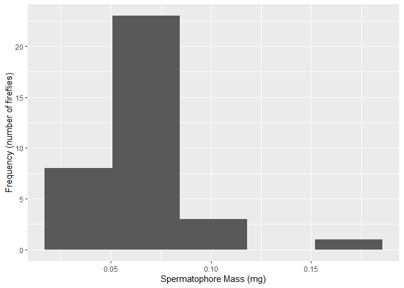

Lab 3: Introduction to ggplot
================
\_\_\_
2021-02-11

Welcome to my Lab 2 repository for Quantitative Biology BIOL 275 at
MSUM.

## Lab objectives

The objectives of this lab are: Understand the layered grammar of
graphics Create a graph showing the distribution of a single variable\_
Set the image width for an R Markdown code chunk

## Repository contents

I created a histogram of the firefly data

``` r
# Load packages -----------------------------------------------------------

library(tidyverse)
```

    ## -- Attaching packages --------------------------------------- tidyverse 1.3.0 --

    ## v ggplot2 3.3.3     v purrr   0.3.4
    ## v tibble  3.0.5     v dplyr   1.0.3
    ## v tidyr   1.1.2     v stringr 1.4.0
    ## v readr   1.4.0     v forcats 0.5.0

    ## -- Conflicts ------------------------------------------ tidyverse_conflicts() --
    ## x dplyr::filter() masks stats::filter()
    ## x dplyr::lag()    masks stats::lag()

``` r
# Firefly figure ----------------------------------------------------------

firefly_data <- read_csv('https://whitlockschluter.zoology.ubc.ca/wp-content/data/chapter02/chap02q19FireflySpermatophoreMass.csv')
```

    ## 
    ## -- Column specification --------------------------------------------------------
    ## cols(
    ##   spermatophoreMass = col_double()
    ## )

``` r
# add a histogram
ggplot(data = firefly_data) +
  geom_histogram(mapping = aes(x = spermatophoreMass), bins =5)+
  labs(x = "Spermatophore Mass (mg)", y = "Frequency (number of fireflies)")
```

<!-- -->

I created a histogram for the birds data

``` r
library(auk)                          
```

    ## auk 0.4.2 is designed for EBD files downloaded after 2019-08-15. 
    ## No EBD data directory set, see ?auk_set_ebd_path to set EBD_PATH 
    ## eBird taxonomy version:  2019

``` r
birds <- ebird_taxonomy %>%
  as_tibble() %>%             
  filter(category == "species")     


  ggplot(data = birds) +
  geom_bar(mapping = aes(x = fct_infreq(order)), fill = "#C5351B", 
           width = .8) +
  labs(x = "Order", y = "Frequency (number of species)") +
  scale_y_continuous(limits = c(0, NA), expand = expansion(mult = 0)) +
  theme_classic(base_size = 12) +
  theme(
    axis.title = element_text(face = "bold"),
    axis.text = element_text(color = "black", size = rel(1)),
    axis.text.x = element_text(angle = 45, hjust = 1),
    axis.ticks.x = element_blank()
  )
```

<!-- -->
